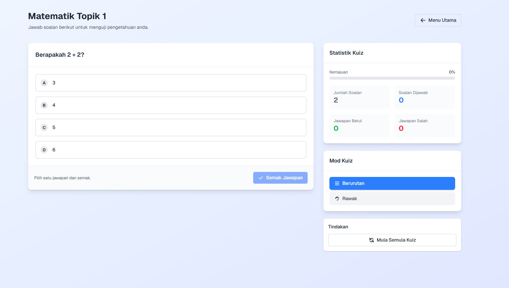

# Quiz System

Quiz System is an interactive quiz application built with Next.js and Tailwind CSS. The application provides various quiz modes, progress tracking, and a responsive interface with a Malay language UI.



## Features

- **Quiz Selection**: Choose quizzes based on categories and subcategories
- **Multiple Choice Questions**: Interactive questions with answer options
- **Three Quiz Modes**:
  - **Sequential**: Answer questions in order
  - **Random**: Answer questions in random order
  - **Wrong Questions**: Retry questions answered incorrectly
- **Progress Tracking**: Progress is saved and synchronized across all modes
- **Statistics Panel**: Display of current performance statistics during the quiz
- **Answer Explanations**: Detailed explanations for correct answers
- **Responsive Design**: Works well on all device sizes
- **Local Storage**: Progress saved in local storage
- **Malay Language Interface**: All UI elements in Malay language
- **Completion Screen**: Options to restart, retry wrong questions, or return to the main menu

## Technologies

- [Next.js 15.5.2](https://nextjs.org/) - React framework
- [React 19.1.0](https://react.dev/) - JavaScript library
- [Tailwind CSS 4](https://tailwindcss.com/) - Utility-first CSS framework
- [TypeScript](https://www.typescriptlang.org/) - JavaScript with syntax for types

## Getting Started

### Prerequisites

- Node.js (version 18.17 or higher)
- pnpm (recommended)

### Installation

1. Clone this repository:

```bash
git clone https://github.com/yourusername/quiz-system.git
cd quiz-system
```

2. Install all dependencies:

```bash
pnpm install
```

3. Run the development server:

```bash
pnpm dev
```

4. Open [http://localhost:3000](http://localhost:3000) with your browser to see the application.

## Project Structure

```
src/
├── app/
│   ├── components/     # UI and quiz components
│   ├── data/           # Quiz data
│   ├── hooks/          # Custom React hooks
│   ├── quiz/           # Quiz pages
│   ├── types/          # TypeScript interfaces and types
│   ├── utils/          # Utility functions
│   ├── globals.css     # Global styles
│   ├── layout.tsx      # Main layout
│   └── page.tsx        # Main page
```

## Usage

1. **Select Quiz**: On the main page, select the quiz category and subcategory you want to answer.

2. **Answer Questions**: Select the correct answer and click "Check Answer" to see if your answer is correct.

3. **View Explanation**: After checking your answer, an explanation will be displayed.

4. **Navigate**: Use the "Next Question" button to go to the next question.

5. **Change Mode**: Use the mode selector to switch between Sequential, Random, or Wrong Questions modes.

6. **View Statistics**: The statistics panel shows your progress in the current quiz.

7. **Complete Quiz**: After answering all questions, a completion screen will be displayed with options to restart, retry wrong questions, or return to the main menu.

## Customizing Quiz Data

You can add or modify quiz data in the `src/app/data/quizData.ts` file. The data format is as follows:

```typescript
{
  id: 'category-subcategory',
  title: 'Quiz Title',
  categoryId: 'category',
  subcategoryId: 'subcategory',
  questions: [
    {
      id: '1',
      text: 'Question?',
      options: [
        { id: 'a', text: 'Option A' },
        { id: 'b', text: 'Option B' },
        { id: 'c', text: 'Option C' },
        { id: 'd', text: 'Option D' }
      ],
      correctOptionId: 'a',
      explanation: 'Answer explanation'
    }
  ]
}
```

## License

This project is licensed under the MIT License - see the [LICENSE](LICENSE) file for details.

## Acknowledgments

- Built with [Next.js](https://nextjs.org/)
- Styled with [Tailwind CSS](https://tailwindcss.com/)
- Icons from [Heroicons](https://heroicons.com/)
